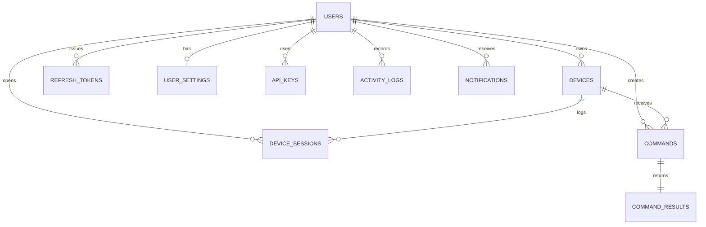
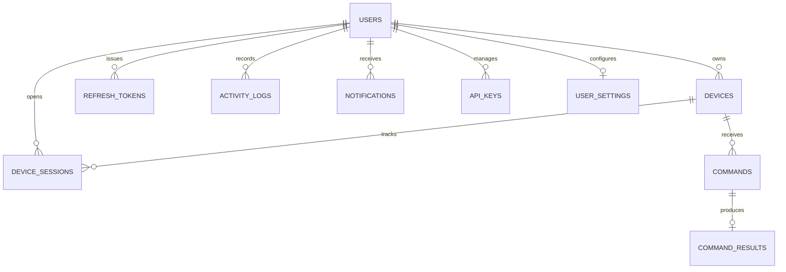

# ER Diagram

```mermaid
erDiagram
    USERS ||--o{ DEVICES : owns
    USERS ||--o{ DEVICE_SESSIONS : opens
    USERS ||--o{ COMMANDS : creates
    USERS ||--o{ REFRESH_TOKENS : issues
    USERS ||--o| USER_SETTINGS : has
    USERS ||--o{ API_KEYS : uses
    DEVICES ||--o{ COMMANDS : receives
    DEVICES ||--o{ DEVICE_SESSIONS : logs
    COMMANDS ||--|| COMMAND_RESULTS : returns
    USERS ||--o{ ACTIVITY_LOGS : records
    USERS ||--o{ NOTIFICATIONS : receives
```
# ER Diagram

```mermaid
erDiagram
    USERS ||--o{ DEVICES : owns
    USERS ||--o{ DEVICE_SESSIONS : opens
    USERS ||--o{ REFRESH_TOKENS : issues
    USERS ||--o{ ACTIVITY_LOGS : records
    USERS ||--o{ NOTIFICATIONS : receives
    USERS ||--o{ API_KEYS : manages
    USERS ||--o| USER_SETTINGS : configures
    DEVICES ||--o{ DEVICE_SESSIONS : tracks
    DEVICES ||--o{ COMMANDS : receives
    COMMANDS ||--o| COMMAND_RESULTS : produces
```
